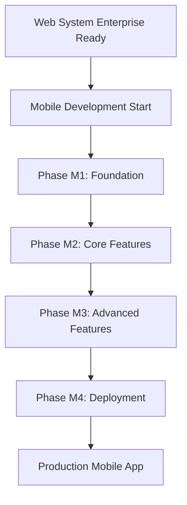

# 📱 GEO-ALERT MOBILE - DEDICATED ROADMAP
**Version:** 1.0 - Mobile Application Development
**Created:** 2025-10-12
**Author:** Γιώργος Παγώνης & Claude
**Status:** 🔄 **DEFERRED** - Pending Web System Enterprise Readiness

---

## 📋 EXECUTIVE SUMMARY

### **Mobile Vision**
Το **GEO-ALERT Mobile** θα είναι η native mobile εκδοχή του web system με:
- **React Native architecture** για iOS/Android
- **Offline-first capabilities** με local storage
- **Push notifications** για real-time alerts
- **Native maps integration** (Apple Maps/Google Maps)
- **Location-based services** με background processing

### **Strategic Decision**
**🎯 Mobile development DEFERRED until web system is enterprise-ready:**
- **Reason**: Ensure solid backend foundation before mobile expansion
- **Timeline**: Start mobile development after Phase 4 completion
- **Dependencies**: Testing infrastructure, monitoring, security hardening

---

## 🏗️ MOBILE ARCHITECTURE BLUEPRINT

### **Technical Stack**
```typescript
Mobile Technology Stack:
├── Frontend Framework: React Native (TypeScript)
├── State Management: Redux Toolkit + RTK Query
├── Navigation: React Navigation v6
├── Maps: react-native-maps (iOS/Android universal)
├── Push Notifications: @react-native-firebase/messaging
├── Offline Storage: @react-native-async-storage/async-storage
├── Location Services: @react-native-community/geolocation
└── Core Integration: @geo-alert/core (shared with web)
```

### **Shared Core Integration**
```typescript
// Mobile will reuse entire web core system
import {
  usePolygonSystem,
  useAlertEngine,
  AlertManagementPanel // Adapted for mobile
} from '@geo-alert/core';

// User Type Support (same as web)
type MobileUserType = 'citizen' | 'professional' | 'technical';
```

---

## 📱 MOBILE-SPECIFIC FEATURES

### **1️⃣ Native Capabilities**
- **📍 GPS Integration**: Real-time location tracking
- **📷 Camera Access**: Photo capture για floor plan uploads
- **📳 Haptic Feedback**: Touch responses για better UX
- **🔔 Push Notifications**: Background alert delivery
- **💾 Offline Mode**: Work without internet connection

### **2️⃣ Mobile UI Adaptations**
- **Touch-First Design**: Large buttons, gesture support
- **Portrait/Landscape**: Responsive layouts
- **Dark Mode Support**: System theme integration
- **Accessibility**: VoiceOver/TalkBack support
- **Performance**: 60fps animations, lazy loading

### **3️⃣ Platform-Specific Features**

#### **🍎 iOS Exclusive**
- Apple Maps integration
- Core Location framework
- iOS push notifications (APNs)
- TestFlight beta distribution
- App Store deployment

#### **🤖 Android Exclusive**
- Google Maps integration
- Android location services
- Firebase Cloud Messaging (FCM)
- Google Play Console
- Play Store deployment

---

## 🎯 MOBILE DEVELOPMENT PHASES

## **Phase M1: Foundation Setup** ⏳ (Future)
> **Duration**: 2 weeks | **Priority**: HIGH | **Status**: 🔄 Deferred

### **M1.1: Project Initialization**
```bash
# React Native CLI setup
npx react-native init GeoAlertMobile --template react-native-template-typescript

# Core package integration
cd GeoAlertMobile
npm install @geo-alert/core
npm install react-native-maps @react-native-async-storage/async-storage
```

### **M1.2: Development Environment**
- **iOS Setup**: Xcode, iOS Simulator, CocoaPods
- **Android Setup**: Android Studio, Android SDK, Gradle
- **Metro Configuration**: Custom resolver for @geo-alert/core
- **Debugging Tools**: Flipper, React Native Debugger

### **M1.3: Core Architecture**
- **Navigation Structure**: Stack + Tab navigators
- **State Management**: Redux store setup
- **API Layer**: RTK Query για backend communication
- **Error Handling**: Centralized error boundaries

---

## **Phase M2: Core Features** ⏳ (Future)
> **Duration**: 3 weeks | **Priority**: HIGH | **Status**: 🔄 Deferred

### **M2.1: User Authentication**
- **Login/Register**: Mobile-optimized forms
- **Biometric Auth**: Face ID/Touch ID/Fingerprint
- **Session Management**: Secure token storage
- **User Type Selection**: Same as web (Citizen/Professional/Technical)

### **M2.2: Map Integration**
- **Native Maps**: Platform-appropriate map provider
- **Polygon Drawing**: Touch-based drawing tools
- **Location Services**: GPS integration με permissions
- **Offline Maps**: Cached map tiles για offline use

### **M2.3: Alert Management**
- **Alert Creation**: Mobile-optimized wizard
- **Push Notifications**: Real-time alert delivery
- **Background Processing**: Location monitoring
- **Alert History**: Local storage με sync

---

## **Phase M3: Advanced Features** ⏳ (Future)
> **Duration**: 2 weeks | **Priority**: MEDIUM | **Status**: 🔄 Deferred

### **M3.1: Camera & Media**
- **Photo Capture**: Floor plan photography
- **Image Processing**: Auto-crop, enhancement
- **File Upload**: Progress indicators, retry logic
- **Gallery Integration**: Photo library access

### **M3.2: Offline Capabilities**
- **Data Synchronization**: Offline-first architecture
- **Conflict Resolution**: Merge strategies για data conflicts
- **Background Sync**: Automatic sync when online
- **Storage Management**: Cache cleanup, size limits

### **M3.3: Performance Optimization**
- **Lazy Loading**: Component-level code splitting
- **Image Optimization**: Compressed uploads, caching
- **Memory Management**: Efficient polygon rendering
- **Battery Optimization**: Background task limits

---

## **Phase M4: Platform Deployment** ⏳ (Future)
> **Duration**: 2 weeks | **Priority**: HIGH | **Status**: 🔄 Deferred

### **M4.1: iOS Deployment**
- **App Store Connect**: Developer account setup
- **Certificates & Provisioning**: Code signing
- **TestFlight**: Beta testing distribution
- **App Store Review**: Submission και approval process

### **M4.2: Android Deployment**
- **Google Play Console**: Developer account
- **APK/AAB Generation**: Release builds
- **Internal Testing**: Google Play testing tracks
- **Play Store Release**: Production deployment

### **M4.3: CI/CD Pipeline**
- **Automated Builds**: GitHub Actions/Bitrise
- **Code Signing**: Secure certificate management
- **Testing Pipeline**: Unit/Integration/E2E tests
- **Release Automation**: Automated store deployments

---

## 🔗 WEB-MOBILE INTEGRATION

### **Shared Components**
```typescript
// These will be shared between web and mobile
@geo-alert/core/
├── polygon-system/     ← Same polygon logic
├── alert-engine/       ← Same alert management
├── database-system/    ← Same data layer
└── types/             ← Shared TypeScript types
```

### **Platform-Specific Adaptations**
```typescript
// Mobile-specific implementations
src/mobile/
├── components/
│   ├── CitizenMobileInterface.tsx    ← Touch-optimized
│   ├── ProfessionalMobileInterface.tsx
│   └── TechnicalMobileInterface.tsx
├── navigation/
│   ├── AppNavigator.tsx              ← React Navigation
│   └── TabNavigator.tsx
└── services/
    ├── LocationService.ts            ← GPS integration
    ├── PushNotificationService.ts    ← Push notifications
    └── OfflineStorageService.ts      ← Local storage
```

---

## 📊 SUCCESS METRICS

### **Technical KPIs**
- **App Store Rating**: >4.5 stars
- **Crash-Free Sessions**: >99.5%
- **App Launch Time**: <2 seconds
- **Battery Usage**: <5% per hour active use
- **Offline Functionality**: 100% core features available

### **User Experience KPIs**
- **User Adoption**: >80% of web users try mobile
- **Retention Rate**: >70% after 30 days
- **Feature Usage**: All user types actively use mobile interfaces
- **Push Notification Engagement**: >60% open rate

---

## 🎯 INTEGRATION TIMELINE

### **Dependency Chain**


### **Critical Dependencies**
1. **✅ @geo-alert/core package** - Already available
2. **⏳ Web system testing** - Phase 3A requirement
3. **⏳ Backend API stability** - Phase 3B requirement
4. **⏳ Security hardening** - Phase 3C requirement
5. **⏳ Production deployment** - Phase 3D requirement

---

## 🚀 **READINESS CHECKLIST**

### **Prerequisites για Mobile Development:**
- [ ] Web system has comprehensive test coverage (>90%)
- [ ] Backend APIs are stable και documented
- [ ] Security audit completed
- [ ] Performance benchmarks established
- [ ] Production deployment successful
- [ ] User feedback collected from web version
- [ ] Mobile development team assembled
- [ ] iOS/Android developer accounts ready

### **When to Start Mobile Development:**
**🎯 Start Date**: After successful completion of **Web Enterprise Readiness** (Phases 3A-3D)

**📅 Estimated Timeline**: Q1 2025 (assuming web system completion by end 2024)

---

## 📚 TECHNICAL DOCUMENTATION

### **Architecture Documents** (To be created)
- **Mobile System Architecture**: Technical design document
- **API Integration Guide**: Backend communication patterns
- **Platform-Specific Guidelines**: iOS/Android best practices
- **Testing Strategy**: Mobile testing approach
- **Deployment Guide**: Store submission processes

### **Development Standards**
- **Code Quality**: ESLint, Prettier, TypeScript strict mode
- **Testing**: Jest, Detox (E2E), native testing frameworks
- **Performance**: Flipper profiling, memory leak detection
- **Security**: Secure storage, certificate pinning, obfuscation

---

## 📱 **MOBILE FIRST PRINCIPLES**

### **Design Philosophy**
1. **Touch-First UI**: Gestures over clicks
2. **Performance-First**: 60fps interactions
3. **Offline-First**: Work without internet
4. **Battery-First**: Efficient background processing
5. **Accessibility-First**: Screen reader support

### **Enterprise Mobile Standards**
- **Security**: Biometric authentication, secure storage
- **Compliance**: Platform store guidelines, enterprise policies
- **Scalability**: Support millions of users
- **Maintainability**: Modular architecture, automated testing
- **Monitoring**: Crash reporting, performance analytics

---

**📍 Location**: `F:\Pagonis_Nestor\GEO_ALERT_MOBILE_ROADMAP.md`
**🔗 Main Roadmap**: `GEO_ALERT_ROADMAP.md`
**🚀 Status**: Ready για implementation after web enterprise readiness

---

**Built with ❤️ for GEO-ALERT Mobile Platform**
**Deferred until web system is enterprise-grade** 🏢