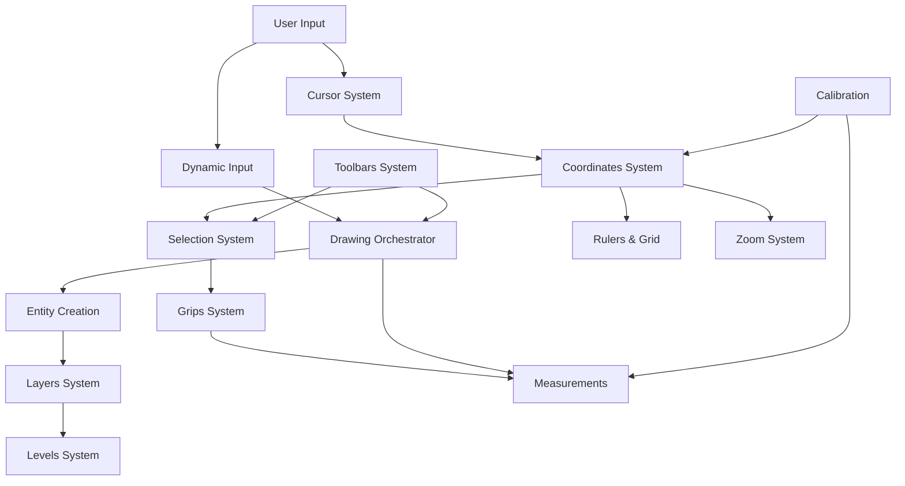

# DXF Viewer Systems Architecture

## Overview

The DXF Viewer is built with a modular systems architecture, where each system handles a specific aspect of CAD functionality. This approach ensures clean separation of concerns, maintainability, and scalability.

## Core Systems

### 1. **Coordinates System** 📍
- **Purpose**: Manages all coordinate transformations and space conversions
- **Key Features**:
  - World ↔ Screen coordinate transformation
  - Viewport management
  - Zoom and pan calculations
  - Grid alignment and snapping coordinates

### 2. **Selection System** 🔺
- **Purpose**: Handles entity selection and multi-select operations
- **Key Features**:
  - Single and multi-entity selection
  - Selection box/marquee
  - Selection highlighting
  - Selection state management

### 3. **Layers System** 📚
- **Purpose**: Manages drawing layers similar to AutoCAD
- **Key Features**:
  - Layer creation and management
  - Visibility toggling
  - Layer locking
  - Color and style per layer
  - Z-order management

### 4. **Levels System** 🏗️
- **Purpose**: Provides hierarchical organization of entities
- **Key Features**:
  - Level-based entity grouping
  - Level visibility control
  - Nested level support
  - Level-specific transformations

### 5. **Drawing Orchestrator** 🎨
- **Purpose**: Coordinates all drawing operations
- **Key Features**:
  - Tool state management
  - Drawing workflow coordination
  - Preview entity management
  - Point collection for multi-point tools

### 6. **Dynamic Input System** ⌨️
- **Purpose**: Provides AutoCAD-style dynamic input
- **Key Features**:
  - Coordinate input fields
  - Distance and angle input
  - Tab navigation between fields
  - Real-time preview updates

### 7. **Grips System** 🔧
- **Purpose**: Entity manipulation through grip points
- **Key Features**:
  - Grip point generation
  - Grip dragging and editing
  - Multi-grip selection
  - Grip-based transformations

### 8. **Entity Creation System** ✏️
- **Purpose**: Manages creation of new entities
- **Key Features**:
  - Support for lines, circles, rectangles, polylines
  - Interactive creation with preview
  - Snap-aware creation
  - Template-based entity creation

### 9. **Rulers & Grid System** 📏
- **Purpose**: Visual guides and measurement aids
- **Key Features**:
  - Dynamic rulers with zoom-aware scaling
  - Configurable grid with major/minor lines
  - Grid snapping
  - Measurement display

### 10. **Zoom System** 🔍
- **Purpose**: View navigation and scaling
- **Key Features**:
  - Mouse wheel zoom
  - Zoom to extents
  - Zoom window
  - Pan and zoom constraints

### 11. **Cursor System** ➕
- **Purpose**: Custom cursor management
- **Key Features**:
  - Crosshair cursor
  - Aperture box for selection
  - Context-aware cursor changes
  - Coordinate tracking

### 12. **Calibration System** 📐
- **Purpose**: Real-world measurement calibration
- **Key Features**:
  - Scale factor calculation
  - Unit conversion
  - Reference dimension setting
  - Measurement accuracy

### 13. **Measurements System** 📊
- **Purpose**: Distance and angle measurements
- **Key Features**:
  - Linear measurements
  - Angular measurements
  - Area calculations
  - Continuous measurement chains

### 14. **Toolbars System** 🎛️
- **Purpose**: UI toolbar management
- **Key Features**:
  - Customizable toolbars
  - Tool grouping
  - Hotkey management
  - Toolbar state persistence

## System Interactions

## Data Flow

1. **User Input** → Captured by Cursor System
2. **Coordinate Transform** → Processed by Coordinates System
3. **Tool Action** → Handled by Drawing Orchestrator
4. **Entity Creation** → Managed by Entity Creation System
5. **Layer Assignment** → Controlled by Layers System
6. **Rendering** → Coordinated by Canvas Engine

## Performance Optimizations

- **Selective Rendering**: Only visible entities are rendered
- **Layer Caching**: Inactive layers are cached
- **Viewport Culling**: Entities outside viewport are skipped
- **Event Throttling**: Mouse events are throttled with RAF
- **Batch Operations**: Multiple entity updates are batched

## State Management

Each system maintains its own state through:
- React Context for UI state
- Zustand stores for shared state
- Local component state for ephemeral data

## Extension Points

New systems can be added by:
1. Creating a new folder in `/systems`
2. Implementing the system hooks and components
3. Registering with the Drawing Orchestrator
4. Adding UI controls to the Toolbars System

## Best Practices

- Each system should be independent and self-contained
- Use TypeScript interfaces for all public APIs
- Implement proper error boundaries
- Write unit tests for critical functions
- Document all public methods with JSDoc
- Follow the established naming conventions