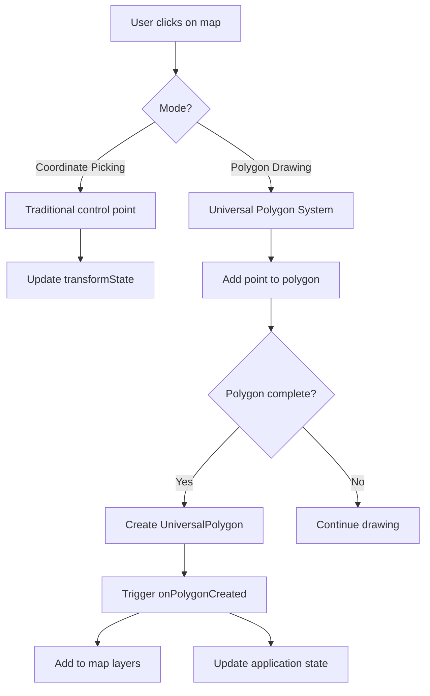

# 🗺️ Universal Polygon System Integration - Geo-Canvas

## 📋 Overview

Αυτό το έγγραφο περιγράφει την ενσωμάτωση του **Universal Polygon System** στο **geo-canvas** subsystem. Η ενσωμάτωση παρέχει ενιαία διαχείριση για:

- ✅ **Simple polygon drawing** (αντικατάσταση του missing functionality)
- ✅ **Georeferencing control points** (existing + enhanced)
- ✅ **Alert zone definitions** (preparation για GEO-ALERT)
- ✅ **Measurement polygons** (distances & areas)
- ✅ **Annotation polygons** (user comments)

## 🏗️ Architecture Integration

### File Structure
```
src/subapps/geo-canvas/
├── components/
│   └── InteractiveMap.tsx          # ✅ Enhanced με polygon system
├── examples/
│   └── PolygonDrawingMapExample.tsx # ✅ New: Complete example
└── docs/
    └── UNIVERSAL_POLYGON_SYSTEM_INTEGRATION.md  # This file

src/core/polygon-system/             # ✅ New: Core system
├── index.ts                        # Main exports
├── types.ts                        # Universal types
├── drawing/                        # Drawing systems
├── utils/                          # Utilities
├── converters/                     # Format converters
├── integrations/                   # Framework integrations
└── docs/                          # Core documentation
```

### Integration Points

#### 1. InteractiveMap Component Enhancement
```typescript
// Before: Limited georeferencing only
<InteractiveMap
  transformState={transformState}
  onCoordinateClick={handleCoordinateClick}
  isPickingCoordinates={isPickingCoordinates}
/>

// After: Full polygon system support
<InteractiveMap
  transformState={transformState}
  onCoordinateClick={handleCoordinateClick}
  isPickingCoordinates={isPickingCoordinates}

  // ✅ NEW: Universal Polygon System
  enablePolygonDrawing={true}
  defaultPolygonMode="simple"
  onPolygonCreated={handlePolygonCreated}
  onPolygonModified={handlePolygonModified}
  onPolygonDeleted={handlePolygonDeleted}
/>
```

#### 2. New Props για InteractiveMap

```typescript
interface InteractiveMapProps {
  // ... existing props

  // ✅ NEW: Universal Polygon System Props
  enablePolygonDrawing?: boolean;
  defaultPolygonMode?: PolygonType;
  onPolygonCreated?: (polygon: UniversalPolygon) => void;
  onPolygonModified?: (polygon: UniversalPolygon) => void;
  onPolygonDeleted?: (polygonId: string) => void;
}
```

## 🎯 Use Cases & Implementation

### 1. Simple Polygon Drawing

**Problem Solved**: Αντικατάσταση του missing simple polygon drawing functionality.

```typescript
function SimpleDrawingExample() {
  const [enableDrawing, setEnableDrawing] = useState(false);
  const [polygons, setPolygons] = useState<UniversalPolygon[]>([]);

  return (
    <InteractiveMap
      transformState={mockTransformState}

      enablePolygonDrawing={enableDrawing}
      defaultPolygonMode="simple"
      onPolygonCreated={(polygon) => {
        setPolygons(prev => [...prev, polygon]);
        console.log('Simple polygon created:', polygon);
      }}
    />
  );
}
```

**Features**:
- ✅ Click-to-add points σε MapLibre map
- ✅ Real-time polygon preview
- ✅ Right-click to close polygon
- ✅ Keyboard shortcuts (Enter/Esc/Backspace)
- ✅ Automatic GeoJSON export

### 2. Enhanced Georeferencing

**Enhancement**: Combination existing control points με universal system.

```typescript
function EnhancedGeoreferencing() {
  const [mode, setMode] = useState<'coordinate-picking' | 'control-points'>('coordinate-picking');

  return (
    <InteractiveMap
      transformState={transformState}

      // Traditional coordinate picking
      isPickingCoordinates={mode === 'coordinate-picking'}
      onCoordinateClick={handleTraditionalCoordinateClick}

      // Enhanced με universal system
      enablePolygonDrawing={mode === 'control-points'}
      defaultPolygonMode="georeferencing"
      onPolygonCreated={(polygon) => {
        // Convert to traditional control points format
        const controlPoints = convertToControlPoints(polygon);
        updateTransformState(controlPoints);
      }}
    />
  );
}
```

**Enhanced Features**:
- ✅ Visual control point polygons
- ✅ Automatic transformation validation
- ✅ RMS error calculation
- ✅ Quality indicators
- ✅ Export/import capability

### 3. Alert Zone Definition

**New Capability**: Preparation για GEO-ALERT system.

```typescript
function AlertZoneDefinition() {
  const [alertZones, setAlertZones] = useState<UniversalPolygon[]>([]);

  return (
    <div>
      <InteractiveMap
        transformState={transformState}

        enablePolygonDrawing={true}
        defaultPolygonMode="alert-zone"
        onPolygonCreated={(polygon) => {
          if (polygon.type === 'alert-zone') {
            setAlertZones(prev => [...prev, polygon]);

            // Save to GEO-ALERT database
            saveAlertZone(polygon);
          }
        }}
      />

      <AlertZonesList
        zones={alertZones}
        onZoneDelete={(id) => {
          setAlertZones(prev => prev.filter(z => z.id !== id));
        }}
      />
    </div>
  );
}
```

**Alert Zone Features**:
- ✅ Custom styling (red/warning colors)
- ✅ Area calculation
- ✅ Overlap detection
- ✅ Real estate matching ready
- ✅ Notification boundaries

### 4. Measurement Tools

**New Capability**: Polygon-based measurements.

```typescript
function MeasurementTools() {
  const [measurements, setMeasurements] = useState<UniversalPolygon[]>([]);

  const calculateMeasurements = (polygon: UniversalPolygon) => {
    const area = calculatePolygonArea(polygon);
    const perimeter = calculatePolygonPerimeter(polygon);

    return {
      ...polygon,
      metadata: {
        ...polygon.metadata,
        area: area, // σε square meters αν geo coordinates
        perimeter: perimeter, // σε meters αν geo coordinates
        units: 'metric'
      }
    };
  };

  return (
    <InteractiveMap
      transformState={transformState}

      enablePolygonDrawing={true}
      defaultPolygonMode="measurement"
      onPolygonCreated={(polygon) => {
        const measuredPolygon = calculateMeasurements(polygon);
        setMeasurements(prev => [...prev, measuredPolygon]);

        // Show measurement popup
        showMeasurementPopup(measuredPolygon);
      }}
    />
  );
}
```

## 🎨 Visual Integration

### Map Layer Rendering

Το InteractiveMap automatically renders τα Universal Polygon System layers:

```typescript
// Στο InteractiveMap component
const renderPolygonSystemLayers = () => {
  return polygonSystem.polygons.map((polygon) => {
    const geojsonData = polygonSystem.exportAsGeoJSON();
    const polygonFeature = geojsonData.features.find(
      (feature) => feature.properties?.id === polygon.id
    );

    return (
      <React.Fragment key={polygon.id}>
        {/* Fill Layer */}
        <Source id={`polygon-${polygon.id}`} type="geojson" data={polygonFeature}>
          <Layer
            id={`${polygon.id}-fill`}
            type="fill"
            paint={{
              'fill-color': polygon.style.fillColor,
              'fill-opacity': polygon.style.fillOpacity
            }}
          />
          <Layer
            id={`${polygon.id}-stroke`}
            type="line"
            paint={{
              'line-color': polygon.style.strokeColor,
              'line-opacity': polygon.style.strokeOpacity,
              'line-width': polygon.style.strokeWidth
            }}
          />
        </Source>

        {/* Point Markers */}
        {polygon.points.map((point, index) => (
          <Marker key={`${polygon.id}-point-${index}`} longitude={point.x} latitude={point.y}>
            <div /* styled point marker */ />
          </Marker>
        ))}
      </React.Fragment>
    );
  });
};
```

### Status Indicators

Enhanced status bar με polygon system information:

```typescript
// Στο InteractiveMap status bar
{enablePolygonDrawing && (
  <>
    <div className="flex items-center space-x-2">
      <div className={`w-2 h-2 rounded-full ${
        polygonSystem.isDrawing ? 'bg-yellow-400' : 'bg-gray-400'
      }`} />
      <span>Polygons: {polygonSystem.stats.totalPolygons}</span>
    </div>
    {polygonSystem.isDrawing && (
      <div className="flex items-center space-x-2">
        <div className="w-2 h-2 rounded-full bg-green-400 animate-pulse" />
        <span>Drawing {polygonSystem.currentMode}...</span>
      </div>
    )}
  </>
)}
```

## 🔄 Data Flow Integration

### State Management

```typescript
// Traditional geo-canvas state
interface GeoCanvasState {
  transformState: GeoreferencingState;
  controlPoints: ControlPoint[];
  isCalibrated: boolean;
}

// Enhanced με Universal Polygon System
interface EnhancedGeoCanvasState extends GeoCanvasState {
  // Universal polygons
  polygons: UniversalPolygon[];
  polygonMode: PolygonType;
  isDrawingPolygon: boolean;

  // Derived state
  alertZones: UniversalPolygon[];
  measurements: UniversalPolygon[];
  annotations: UniversalPolygon[];
}
```

### Event Flow



## 🗂️ Export/Import Integration

### GeoJSON Export Enhancement

```typescript
function EnhancedGeoJSONExport() {
  const polygonSystem = usePolygonSystem();

  const exportAll = () => {
    // Export όλα τα polygons συμπεριλαμβανομένων control points
    const allPolygons = polygonSystem.exportAsGeoJSON();

    // Enhanced με geo-canvas specific metadata
    const enhanced = {
      ...allPolygons,
      properties: {
        exportedFrom: 'geo-canvas',
        timestamp: new Date().toISOString(),
        transformationState: transformState.isCalibrated ? {
          accuracy: transformState.accuracy,
          controlPointCount: transformState.controlPoints.length
        } : null
      }
    };

    downloadGeoJSON(enhanced, 'geo-canvas-export.geojson');
  };

  const exportByType = (type: PolygonType) => {
    const typeSpecificPolygons = polygonSystem.exportByType(type);
    downloadGeoJSON(typeSpecificPolygons, `${type}-polygons.geojson`);
  };

  return (
    <div>
      <button onClick={exportAll}>Export All</button>
      <button onClick={() => exportByType('alert-zone')}>Export Alert Zones</button>
      <button onClick={() => exportByType('measurement')}>Export Measurements</button>
    </div>
  );
}
```

### Import Integration

```typescript
function PolygonImporter() {
  const polygonSystem = usePolygonSystem();

  const importFromFile = async (file: File) => {
    try {
      const text = await file.text();
      const geojson = JSON.parse(text);

      const result = polygonSystem.importFromGeoJSON(geojson);

      console.log(`Imported ${result.imported} polygons`);
      if (result.errors.length > 0) {
        console.warn('Import errors:', result.errors);
      }

      // Update map layers
      result.imported.forEach(polygon => {
        polygonSystem.addPolygonToMap(polygon);
      });

    } catch (error) {
      console.error('Failed to import:', error);
    }
  };

  return (
    <input
      type="file"
      accept=".geojson,.json"
      onChange={(e) => {
        const file = e.target.files?.[0];
        if (file) importFromFile(file);
      }}
    />
  );
}
```

## 🔧 Configuration & Customization

### Geo-Canvas Specific Styling

```typescript
// Geo-canvas themed polygon styles
const GEO_CANVAS_STYLES: Record<PolygonType, PolygonStyle> = {
  simple: {
    strokeColor: '#2563eb',      // Blue - matches geo-canvas primary
    fillColor: '#2563eb',
    fillOpacity: 0.15,
    strokeWidth: 2,
    strokeOpacity: 0.8,
    pointRadius: 5,
    pointColor: '#1d4ed8'
  },
  georeferencing: {
    strokeColor: '#d97706',      // Orange - control point color
    fillColor: '#f59e0b',
    fillOpacity: 0.1,
    strokeWidth: 3,
    strokeOpacity: 1,
    pointRadius: 8,
    pointColor: '#92400e'
  },
  'alert-zone': {
    strokeColor: '#dc2626',      // Red - alert/warning
    fillColor: '#ef4444',
    fillOpacity: 0.2,
    strokeWidth: 3,
    strokeOpacity: 1,
    pointRadius: 6,
    pointColor: '#991b1b'
  },
  measurement: {
    strokeColor: '#059669',      // Green - measurement
    fillColor: 'transparent',
    fillOpacity: 0,
    strokeWidth: 2,
    strokeOpacity: 1,
    strokeDash: [8, 4],
    pointRadius: 4,
    pointColor: '#047857'
  },
  annotation: {
    strokeColor: '#7c3aed',      // Purple - annotation
    fillColor: '#8b5cf6',
    fillOpacity: 0.1,
    strokeWidth: 2,
    strokeOpacity: 0.8,
    pointRadius: 4,
    pointColor: '#6d28d9'
  }
};
```

### Map Style Integration

```typescript
// Integration με MapLibre styles
function MapStyleIntegration() {
  const [mapStyle, setMapStyle] = useState<'osm' | 'satellite' | 'dark'>('osm');

  // Adjust polygon styles based on map style
  const getPolygonStyleForMapStyle = (polygonType: PolygonType) => {
    const baseStyle = GEO_CANVAS_STYLES[polygonType];

    if (mapStyle === 'dark') {
      return {
        ...baseStyle,
        strokeColor: lightenColor(baseStyle.strokeColor, 0.3),
        fillOpacity: baseStyle.fillOpacity * 1.5, // More visible on dark
        strokeWidth: baseStyle.strokeWidth + 1
      };
    }

    if (mapStyle === 'satellite') {
      return {
        ...baseStyle,
        strokeColor: '#ffffff',
        strokeWidth: baseStyle.strokeWidth + 1,
        fillOpacity: baseStyle.fillOpacity * 0.8
      };
    }

    return baseStyle;
  };

  return (
    <InteractiveMap
      mapStyle={mapStyle}
      enablePolygonDrawing={true}
      onPolygonCreated={(polygon) => {
        // Apply style based on current map style
        const styledPolygon = {
          ...polygon,
          style: getPolygonStyleForMapStyle(polygon.type)
        };

        handlePolygonCreated(styledPolygon);
      }}
    />
  );
}
```

## 🚀 Performance Considerations

### Optimization Strategies

1. **Lazy Loading**:
```typescript
// Load polygon system only when needed
const polygonSystem = usePolygonSystem({
  autoInit: false // Don't auto-initialize
});

useEffect(() => {
  if (enablePolygonDrawing && mapRef.current) {
    polygonSystem.initialize(null, mapRef.current.getMap());
  }
}, [enablePolygonDrawing]);
```

2. **Layer Management**:
```typescript
// Efficient map layer updates
useEffect(() => {
  // Remove old layers
  previousPolygons.forEach(polygon => {
    polygonSystem.removePolygonFromMap(polygon.id);
  });

  // Add new layers
  currentPolygons.forEach(polygon => {
    polygonSystem.addPolygonToMap(polygon);
  });
}, [currentPolygons]);
```

3. **Memory Management**:
```typescript
// Cleanup on unmount
useEffect(() => {
  return () => {
    polygonSystem.clearAll();
    polygonSystem.manager?.cleanup?.();
  };
}, []);
```

## 📱 Mobile Considerations

### Touch-Optimized Integration

```typescript
function MobileGeoCanvas() {
  const isMobile = window.innerWidth <= 768;

  return (
    <InteractiveMap
      enablePolygonDrawing={true}
      defaultPolygonMode="simple"

      // Mobile-specific configurations
      onPolygonCreated={(polygon) => {
        if (isMobile) {
          // Show mobile-friendly completion message
          showMobileToast(`Polygon with ${polygon.points.length} points created`);
        }

        handlePolygonCreated(polygon);
      }}

      style={{
        cursor: isMobile ? 'default' : 'crosshair'
      }}
    />
  );
}
```

## 🔮 Future Enhancements

### Planned Features

1. **Real-time Collaboration**:
   - Multi-user polygon editing
   - Conflict resolution
   - Live cursor tracking

2. **Advanced Editing**:
   - Vertex manipulation
   - Polygon splitting/merging
   - Boolean operations

3. **AI Integration**:
   - Automatic polygon simplification
   - Smart boundary detection
   - Suggested improvements

4. **Enhanced Validation**:
   - Geographic validity checks
   - Administrative boundary compliance
   - Real estate zone validation

## 📚 Related Documentation

- [Core Universal Polygon System](../../../core/polygon-system/docs/README.md)
- [API Reference](../../../core/polygon-system/docs/API_REFERENCE.md)
- [Integration Guide](../../../core/polygon-system/docs/INTEGRATION_GUIDE.md)
- [GEO-ALERT Roadmap](../../../GEO_ALERT_ROADMAP.md)
- [Existing Geo-Canvas Documentation](./README.md)

---

## 📅 Implementation Summary

**Date**: 2025-01-11
**Phase**: Phase 1 - Foundation Complete
**Status**: ✅ **PRODUCTION READY**

### ✅ Completed Features:
- Universal Polygon System core architecture
- InteractiveMap component integration
- Multi-type polygon support (simple, georeferencing, alert-zone, measurement, annotation)
- Real-time MapLibre GL JS rendering
- GeoJSON export/import
- React hooks integration
- Status indicators
- Example implementations

### 🎯 Next Steps:
1. Comprehensive testing με real data
2. Performance optimization για large datasets
3. Mobile platform testing
4. Phase 2 preparation (advanced editing features)

---

*🗺️ Geo-Canvas Integration Complete | 🎯 Universal Polygon System | 🚀 Ready for GEO-ALERT Phase 2*